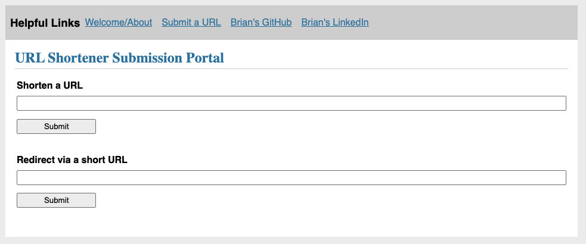

# Flask URL Shortener

This repository contains a Flask web application and REST API. The API accepts a POST request containing
a URL and returns a shortened version of the URL to the requester. It also accepts a GET request containing
a previously returned short URL and returns the full, unabbreviated URL to the requester.

## Running Locally

### Install Python3 and pip

Python3 and pip are required to run this application. If you require either of these resources, please consult the following:

[Install Python](https://www.python.org/downloads/)

[Install pip](https://pip.pypa.io/en/stable/installing/)

### Install Python package requirements

*Note:* it is recommended to install the requirements for this project in the context of a virtual environment
to avoid any potential dependency version contradictions with other Python applications in your environment.
If you are unfamiliar with creating virtual environments, see the [venv documentation](https://docs.python.org/3/tutorial/venv.html).
There are other virtual environment tools for you to choose from as well.

This application depends on the Python package [flask](https://pypi.org/project/Flask/). Before starting the application
install flask by specifying the package directly with pip, `pip install flask` or by using the `requirements.txt` file 
at the root of this project, `pip install -r requirements.txt`.

### Set environmental variables

Before running, we must set an environmental variable `FLASK_APP` that will indicate the path of the application to Flask.
On Linux/Unix devices, run `export FLASK_APP=app`.

Optionally, set Flask to development mode for increased logging `export FLASK_ENV=development`.

### Initialize the database and start the app

To initialize the database, we can take advantage of an initialization command that has been bound to flask.
This command will create an sqlite database in a new directory `app/instance` according to the schema located
at `app/schema.sql`.

From the root project directory, initialize the database with `flask init-db.

After initialization, start the application from the root project directory with `flask run`.

## Using the webapp

Once flask is running, the webapp will be available at `127.0.0.1:5000` (or localhost).
The main functionality is located at `127.0.0.1:5000/submit/`, which is linked through the
"Submit a URL" item in the nav bar.

### Submit a new URL

Use the "Shorten a URL" input field to generate a shortened URL. Input URL's must be unique.
If the request is successful, the page will display the shortened URL corresponding to your submission.

### Redirect to a long URL via a shortened URL

Use the "Redirect via a short URL" input to use your newly generated short URL. Input a valid shortened
URL in the field, click "Submit," and the page will redirect to the original URL.

## Using the API

To add new URL's to the database or retrieve existing ones, use the `/api/urls` endpoint.

### Add a new record

Post a new record to the database and generate a shortened URL by sending a POST request to the `/api/urls` endpoint.
The URL you wish to shorten must be passed in the data of the request under the `url` key.

For example: `curl -X POST --data '{"url":"https://www.conjur.org/"}' "127.0.0.1:5000/api/urls/"`

### Retrieving a record

Get an existing record from the database by ending a GET equest to the `/api/urls` endpoint.
The URL you wish to retrieve must be passed in the data of the request under the `url` key.
This endpoint assumes you are providing a *shortened* URL, and will respond accordingly.

For example: `curl -X GET --data '{"url":"cnjr.lnk/1"}' "127.0.0.1:5000/api/urls/"`

## Containerized Deployment

This application contains native support to build and deploy it as a docker container.
To test this deployment configuration in a local container, two commands are required.

### Build and run the image

From the root of the project, build the docker image: `docker build --tag flask-url-shortener:latest .`.
The tag you provide the image with is arbitrary, but will determine the name by which you are able 
to reference this image in the future.

Next, provide a `docker run` command to deploy the application in a containerized fashion on your machine
`docker run -p 5000:5000 flask-url-shortener`.
The tag at the end of the command must match the tag you provided when the image was built (`flask-url-shortener` in this case).
The `-p` flag is important in this command, as it maps an exposed port in the container back to your local machine.
In this case, we are mapping port 5000 in the container to port 5000 on the local machine. This allows us to access
the flask webapp locally while it's running in the container.

### Access the application

Once the container is running, the flask webapp and API will be available at `127.0.0.1:5000` on your local machine.
